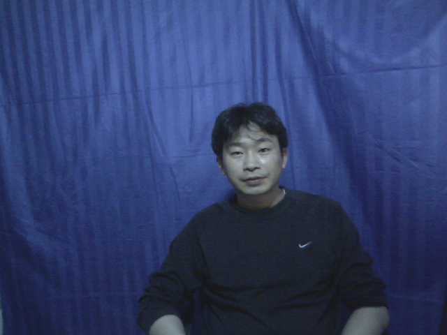
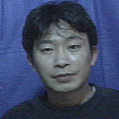
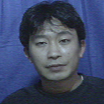
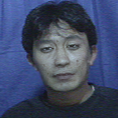
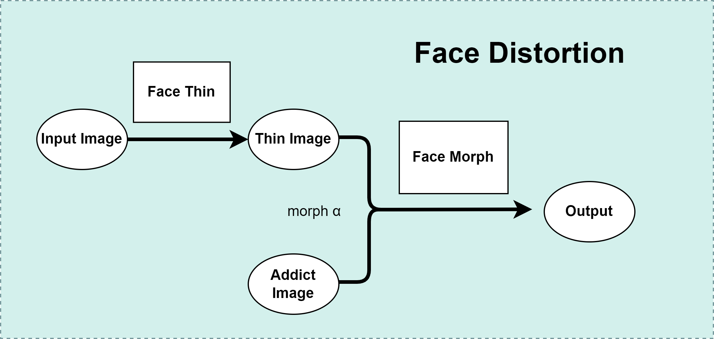

# You after Taking Drugs

See What You’d Look Like as A Drug Addict

English | [简体中文](README_zh-CN.md)

## Get Started(Python 3.7.13)

1. ~~Download the dlib model and put it in the `model` folder. [link](http://dlib.net/files/shape_predictor_68_face_landmarks.dat.bz2)~~
1. `pip install -r requirements.txt`

2. `python face_distort.py` run the demo and see the output

3. Package as exe
Note that cv2 is not a package name, so you must follow these steps:
    1. `pip install opencv-python==4.3.0.38`
    2. `pip install --upgrade pyinstaller`
    3. `pyinstaller --add-data="./config.ini;." --add-data="./resources/*;./resources" --add-data="./model/*;./model" --hidden-import opencv-python face_distort.py`

## Results Preview

Input:

Output:

## System Framework

## Software That Use This Algorithm

From `宁波思伟教育科技有限公司`

## Reference

[ahxc:face_morpher](https://github.com/ahxc/face_morpher)

[Interactive_Image_Warping](http://www.gson.org/thesis/warping-thesis.pdf)

Thanks to `宁波思伟教育科技有限公司` for sponsoring this project!
