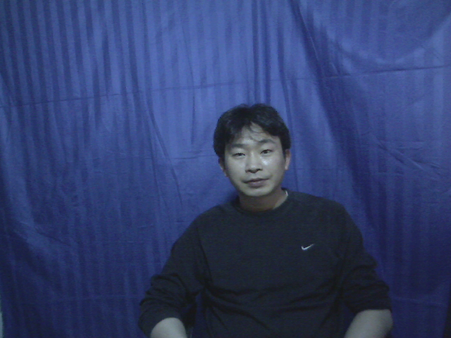
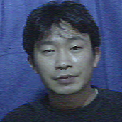
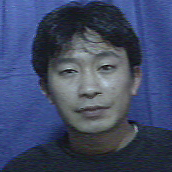
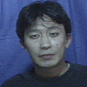
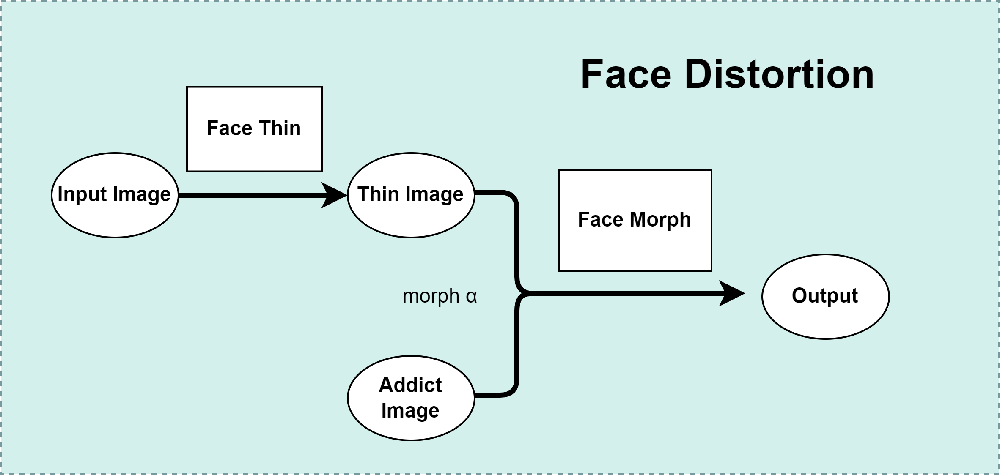

# You after Taking Drugs

模拟吸毒后的面貌变换

[English](README.md) | 简体中文

## Get Started(Python 3.7.13)

1. ~~下载`dlib`模型并放置到`model`文件夹下. [link](http://dlib.net/files/shape_predictor_68_face_landmarks.dat.bz2)~~

1. `pip install -r requirements.txt`

2. `python face_distort.py` 运行demo并查看输出

3. 打包为exe指令
注意，cv2不是包名，因此必须参照如下步骤：
    1. `pip install opencv-python==4.3.0.38`
    2. `pip install --upgrade pyinstaller`
    3. `pyinstaller --add-data="./config.ini;." --add-data="./resources/*;./resources" --add-data="./model/*;./model" --hidden-import opencv-python face_distort.py`

## 结果预览

输入:

输出:

## 算法架构

## 使用该算法的软件

From `宁波思伟教育科技有限公司`

## 参考链接

[ahxc:face_morpher](https://github.com/ahxc/face_morpher)

[Interactive_Image_Warping](http://www.gson.org/thesis/warping-thesis.pdf)
